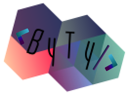

# Collaborative HTML Website

## Práctica de flujo de trabajo con GIT

##### Proyecto ejecutado por Aslan Staub y Rodrigo Carvalho

------------

### Ejercicio:

Creación de una landing page colaborativa, utilizando GIT como sistema de control de versiones.

------------

### Nuestra propuesta:

Diseño de landing page full responsive para nuestra empresa de desarrollo de páginas y aplicaciones web, ByTy BootTeam.

###### Tecnologías utilizadas:
- HTML;
- CSS;

###### Librerías utilizadas:
- Bootstrap;
- Google Fonts;

### Como visualizar el proyecto:
Ejecuta el comando `$ pip3 install flask && python3 server.py` desde la consola.

------------

Ejercicio realizado durante el **Full Stack Developer Coding Bootcamp** de **4Geeks Academy**